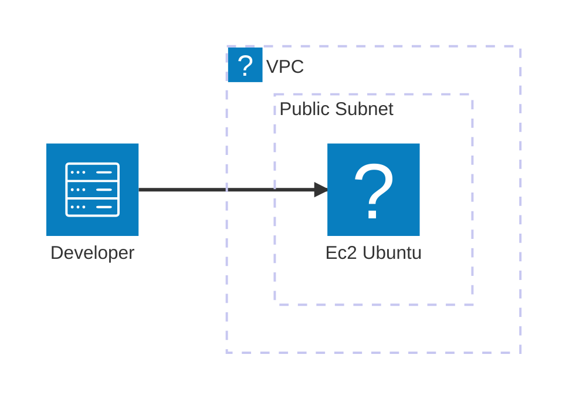

#　構成図

```mermaid
architecture-beta
    group vpc(logos:aws-vpc)[VPC]
    group public_subnet1[Public Subnet] in vpc

    service instance1(logos:aws-ec2)[Ec2 Ubuntu] in public_subnet1
    service dev(server)[Developer]

    dev: R --> L: instance1
```
